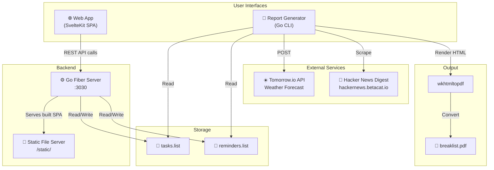
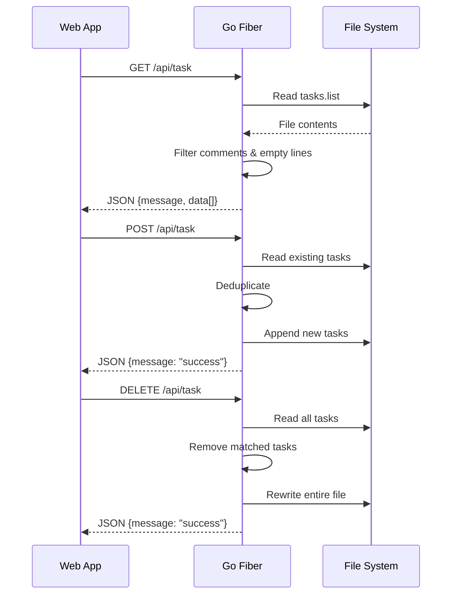
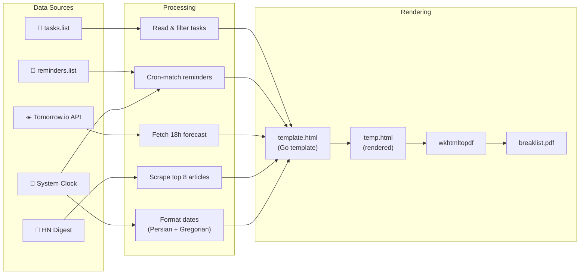
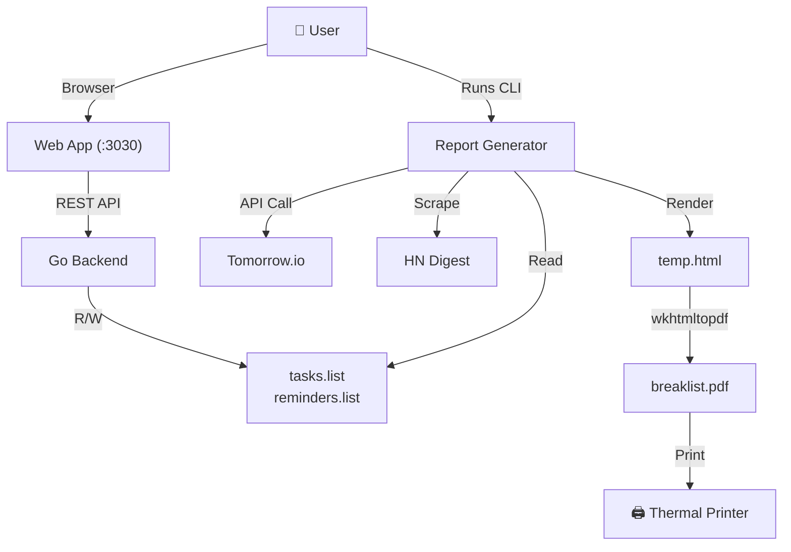

# Architecture

This document provides a deep-dive into Breaklist's architecture, data flow, and component interactions.

## System Overview

Breaklist is a multi-component toolkit with **no shared runtime** — the backend, frontend, and report generator are independent processes that communicate through the filesystem (`.list` files) and configuration (`.env`).



## Components

### 1. Backend — Go Fiber Web Server

**Location:** [`backend/`](file:///h:/iCloudDrive/Scripts/25-printerProj/backend)

The backend is a lightweight REST API built with [GoFiber](https://gofiber.io/) v2. It serves two purposes:

1. **REST API** — CRUD endpoints for tasks and reminders
2. **Static file server** — Serves the pre-built SvelteKit frontend from `./static/`

#### Key Design Decisions

| Decision | Rationale |
|----------|-----------|
| File-based storage (no database) | Simplicity; tasks/reminders are small, single-user data |
| GoFiber framework | Fast, Express-like API; minimal overhead |
| Helmet + CORS middleware | Security headers + cross-origin support for dev mode |
| No authentication | Intended for local/personal use on a home network |

#### Request Flow



#### File Operations

- **Read**: `os.ReadFile()` → split by `\n` → filter comments (`#`) and empty lines
- **Add**: `os.OpenFile(O_APPEND)` → deduplicate against existing → append
- **Delete**: `os.Create()` (truncate) → rewrite all lines except matched ones

> **Note:** The `getLines()` helper function is duplicated identically in both `backend/main.go` and `reportGenerator/main.go`. This is the shared data contract.

---

### 2. Frontend — SvelteKit SPA

**Location:** [`frontend/breaklist/`](file:///h:/iCloudDrive/Scripts/25-printerProj/frontend/breaklist)

A single-page application built with SvelteKit and TypeScript, using `adapter-static` for pre-rendered static output.

#### Stack

| Technology | Version | Purpose |
|------------|---------|---------|
| SvelteKit | 1.30.4 | Application framework |
| Svelte | 4.0.5 | UI component framework |
| TypeScript | 5.x | Type-safe scripting |
| Vite | 4.5.3 | Build tool & dev server |
| adapter-static | 2.0.3 | Static site generation |

#### Application Structure

The entire UI is a **single page** ([`+page.svelte`](file:///h:/iCloudDrive/Scripts/25-printerProj/frontend/breaklist/src/routes/+page.svelte)) with:

- **Task list view** — Displays current tasks with alternating row colors
- **Add task popup** — Modal with text input and blur transition
- **Delete task confirmation** — Popup for confirming task removal
- **Dark/light mode toggle** — Persisted via cookie (380-day expiry)
- **Loading spinner** — CSS-only ripple animation

#### API Communication

```javascript
// In development: proxy to local Go server
const apiBase = dev ? "http://localhost:3030/api/" : "api/";
```

In production, the frontend is served by the Go backend itself, so API calls use relative paths (`api/`). In development, the SvelteKit dev server proxies to the Go backend on port 3030.

#### Theming

- **Dark mode (default):** Deep navy blue (`hsl(215, 68%, 7%)`) with beige text
- **Light mode:** Beige background with dark text
- **Font:** Victor Mono (monospace)
- **Responsive:** 768px breakpoint for desktop vs. mobile layouts

---

### 3. Report Generator — Go CLI

**Location:** [`reportGenerator/`](file:///h:/iCloudDrive/Scripts/25-printerProj/reportGenerator)

A standalone command-line tool that assembles data from multiple sources and generates a thermal-printer-optimized PDF.

#### Data Pipeline



#### External Dependencies

| Dependency | Type | Purpose |
|------------|------|---------|
| [Tomorrow.io](https://api.tomorrow.io/) | HTTP API (POST) | Hourly weather forecast (temperature, apparent temp, weather codes) |
| [hacker-news-digest](https://hackernews.betacat.io/) | Web scraping (Colly) | Article titles, summaries, scores, ranks |
| [wkhtmltopdf](https://wkhtmltopdf.org/) | System binary | HTML → PDF conversion |
| [go-persian-calendar](https://github.com/yaa110/go-persian-calendar) | Go library | Jalali/Persian date formatting |

#### Custom Cron System

The reminder system uses a simplified **3-field cron** format (vs. standard 5-field):

```
┌─── Day of Month (1-31)
│ ┌─── Month (1-12)
│ │ ┌─── Day of Week (0-6, Sunday=0)
│ │ │
* * *|Reminder text here
```

Supported operators: `*` (wildcard), `N` (exact), `N,M` (list), `*/N` (interval)

#### PDF Specifications

| Property | Value |
|----------|-------|
| Page width | 47mm (thermal receipt paper) |
| Page height | 500mm |
| Margins | Top: 1mm, Bottom: 7mm, Left/Right: 0mm |
| Color mode | Grayscale |
| Encoding | UTF-8 |

---

### 4. Weather Icons — Preprocessing Utility

**Location:** [`weatherIcons/`](file:///h:/iCloudDrive/Scripts/25-printerProj/weatherIcons)

A Python utility ([`threshold.py`](file:///h:/iCloudDrive/Scripts/25-printerProj/weatherIcons/threshold.py)) for converting weather icons to high-contrast black & white, optimized for thermal printer output.

#### Processing Pipeline

1. Read images from `raw/`
2. Auto-rotate landscape → portrait
3. Convert to grayscale
4. Apply adaptive Gaussian thresholding (window=11, C=3)
5. Invert colors
6. Save to `thresholded/`

The resulting icons are stored in [`reportGenerator/weathercodes/`](file:///h:/iCloudDrive/Scripts/25-printerProj/reportGenerator/weathercodes) as 152 PNG files named by Tomorrow.io weather codes (e.g., `10000.png` for code 1000).

---

## Build System

### Makefile Targets

| Target | Command | Description |
|--------|---------|-------------|
| `make setup` | `npm install` in frontend | Install frontend dependencies |
| `make all` (default) | Builds all 3 outputs | Full project build |
| `make release` | `goreleaser release --snapshot --clean` | Create release archives |
| `make clean` | `rm -rf build dist` | Remove build artifacts |

### Build Outputs

```
build/
├── webserver             ← backend/main.go
├── reportGenerator       ← reportGenerator/main.go
├── static/               ← frontend/breaklist/build/
├── template.html         ← reportGenerator/template.html
├── weathercodes/         ← reportGenerator/weathercodes/
└── .env.example          ← reportGenerator/.env.example
```

### GoReleaser Configuration

Cross-compiles both Go binaries for all target platforms:

| OS | Architectures |
|----|---------------|
| macOS (darwin) | amd64, arm64, arm, 386 |
| Linux | amd64, arm64, arm, 386 |
| Windows | amd64, arm64, arm, 386 |

Archives include the binaries plus all required runtime assets (`template.html`, `weathercodes/`, `static/`, `.env.example`). Unix archives use `.tar.gz`, Windows uses `.zip`.

---

## Data Flow Summary



The system is designed for **personal, single-user** operation — typically on a Raspberry Pi or home server that runs the web server continuously and triggers the report generator on a schedule (e.g., via cron).
